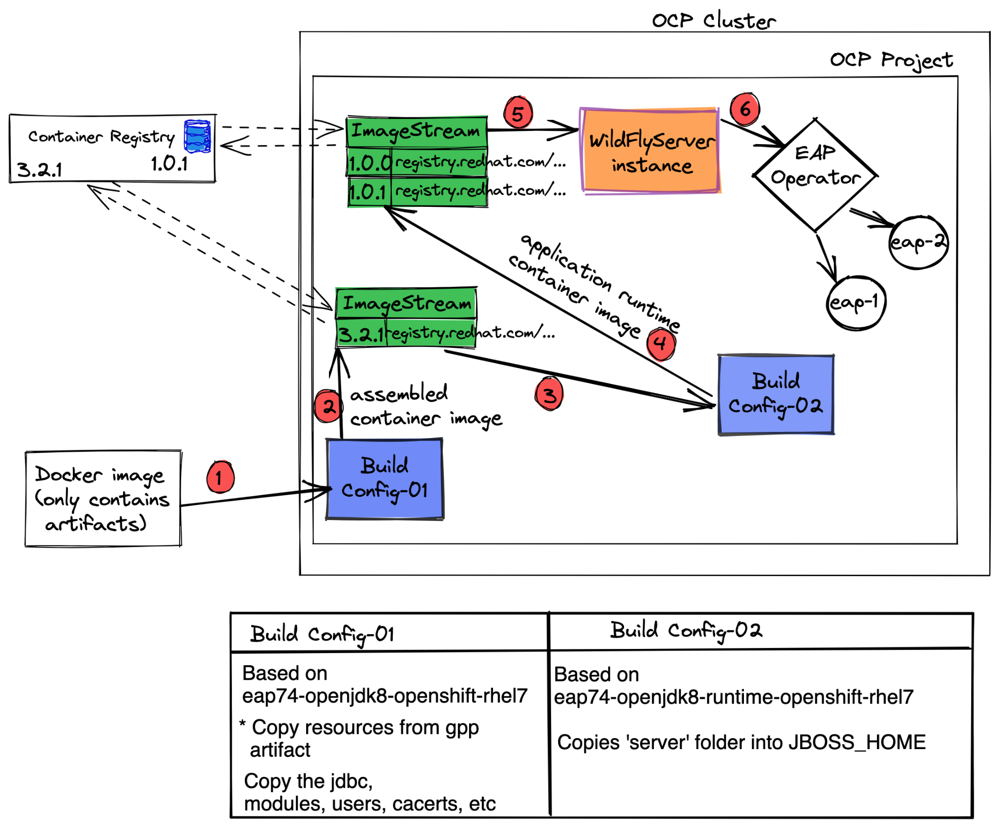

# JBoss-Operator Usage Example
This is an example which demonstrate how to deploy JBoss servers using eap-operator in OCP


### Directory structure 

#### configuration 📁

This folder will be copied into the JBoss server deployments/configurations directory.

#### modules 📁

This folder will be copied into the JBoss server deployments/modules directory.

#### deployments 📁

Your application final artifacts. It could be a .war file or any other deployable unit that you usually deploy into
JBoss server /deployments directory.


## Steps:

### 1. Create your container image
You can either use podman/docker to build the container image
which contains only your artifacts.

**Note:** I have created a quay.io public repository named as `s2i-jboss-artifacts`
My container images will be pushed there.

Build the image while tagging the container image by the quay.io public repository path.
```
docker build -t quay.io/jnirosha/s2i-jboss-artifacts . 
```

### 1.1. Push the container image to a container registry
```
docker push quay.io/jnirosha/s2i-jboss-artifacts
```

### 2. Create ImageStream objects in OCP
#### Artifact ImageStream

This image stream will be referenced in the buildConfig-01 to push the resulting container image.
It is also referenced in buildConfig-02 as a source image.

- According to the [buildConfig-01.yaml](https://github.com/JudeNiroshan/jboss-operator-usage-example/blob/089f07cd24959558bc716604ce3ba2da8758cbd1/buildConfig-01.yaml#L34), imageStream should name as `s2i-jboss-artifacts`

#### Ready to use ImageStream

This image stream will be referenced by the operator wildflyserver instance. It is also
referenced in buildConfig-02 as an output to push the resulting container.

- According to the [wildflyserver.yaml](https://github.com/JudeNiroshan/jboss-operator-usage-example/blob/79d83ef4ec136fe5d84d23acb98eee17100cbdb4/wildflyserver.yaml#L6) and [buildConfig-02.yaml](https://github.com/JudeNiroshan/jboss-operator-usage-example/blob/1f620cbbe226c6d96dbc6055841eb2121508cc59/buildConfig-02.yaml#L9), imageStream should name as `helloworld-eap`

### 3. Connect to OCP cluster from your terminal
Login to OCP console and grab a token and run the `oc login ...`

### 4. Submit buildConfig resource definitions to OCP

Once you connected and switched correct OCP project, you can 
run below commands one after the other.

```
oc apply -f buildCondig-01.yaml

oc apply -f buildCondig-02.yaml
```

These commands will trigger new builds which utilizes the above 
created image streams and create the final deployable container image
which will be eventually pushed to

`image-registry.openshift-image-registry.svc:5000/<<ocp-project>>/helloworld-eap@sha256:d6e5d24b930e93a028fb597efd...`

### 5. Create WildFlyServer instance

```
oc apply -f wildflyserver.yaml
```

### 6. Verify you can access the application

Identify the created route for your deployment. This is visible 
in `networking -> routes -> helloworld-route`

Add the application specific url suffix and check on browser.

E.g:-
```
http://<<helloworld-route>>/helloworld-rs/rest/json
```
