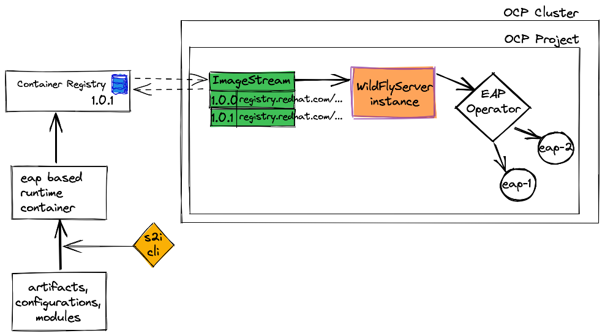

## Red Hat Middleware EAP-Operator usage with s2i-CLI

We are focusing a simple hello world REST API example project. We will 
be deploying this application into Openshift using Red Hat Middleware EAP-Operator.



### 1. Install EAP-Operator into your cluster

Login to Openshift console and under administrator tab, operators can
 be installed under `Operators -> Install`
 
### 2. Install s2i-cli in your machine

[Download the latest s2i-cli](https://github.com/openshift/source-to-image)
and set to your machine's PATH variable.

### 3. Create an ImageStream in Openshift
You can create a new ImageStream in Openshift console UI interface.
Map it to your desired container registry which is accessible from 
openshift cluster. _(In this case, I'm using quay.io which is a free publicly available 
container registry.)_

### 4. Create .s2i directory in your source code root folder
This is already done in this example repository. It will include the 
environment variables file. This environment variables will be injected
at build time of the container.

### 5. Build & push runtime container image
I have used desired container name = `quay.io/jnirosha/s2i-jboss-with-cli`

run the following commands(modify as you wish):
```
./build-app-image.sh . --app-name=quay.io/jnirosha/s2i-jboss-with-cli \
--wildfly-builder-image=registry.redhat.io/jboss-eap-7/eap74-openjdk8-openshift-rhel7:7.4.1 \
--wildfly-runtime-image=registry.redhat.io/jboss-eap-7/eap74-openjdk11-runtime-openshift-rhel8:7.4.1

```

### 6. Create wildflyServerInstance resource in Openshift
```
oc apply -f wildflyserver.yaml
```

### 7. Verify you can access the application

You should see new entry under 
`installed operators -> JBoss EAP -> WildFlyServer(tab)`

You should see a new route which is created by the name you
mentioned in [wildflyServer.yaml](./wildflyServer.yaml)

